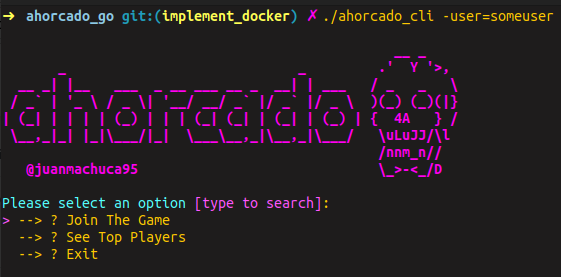

# 💀 (Ahorcado) Multiplayer - Golang

Server developed in go using gRPC for communications that allows you to play the hangman game in a multiplayer way.

For this process it is necessary to previously have an account in mongo.cloud with a database for the game loaded. 

You just need two collections users and game. You can build database follows struct in models user.go and game.go

<b>Nota:</b> you can download image docker run: 
You can download docker image run: 
```
docker pull juanmachuca95/ahorcado:v1
```


 And set the credentials ```MONGODB_NAME``` and ```MONGODB_PASSWORD```


```zsh
docker run --env MONGODB_NAME=xxx --env MONGODB_PASSWORD=xxx -p 8080:8080 juanmachuca95/ahorcado:v1
```

You can find the client to join the game in https://github.com/juanmachuca95/ahorcado_go 

```go
git clone https://github.com/juanmachuca95/ahorcado_go

cd ahorcado_go
// Not need flag -host if you test in local
go run cmd/clients/cli/client.go -user=juanmachuca95 -host=<youhost>

// or 
./ahorcado_cli -user=juanmachuca95 -host=<youhost>
```



This is the game server, but the client for it is also developed.
You have three from CLI
* Join the currente game
* See ranking top players at moment
* Exit

A user will be created automatically with the flag ```-user=<youruser>``` . The rest is intuitive


This game was make with only goal to learn more about mongodb, test in mongodb, grpc stream-bidi, gateway-grpc, docker, docker hub and tls cert to deploys. You feel free to collaborate to improve this approach.


Hecho con cariño <b>@juanmachuca95</b>